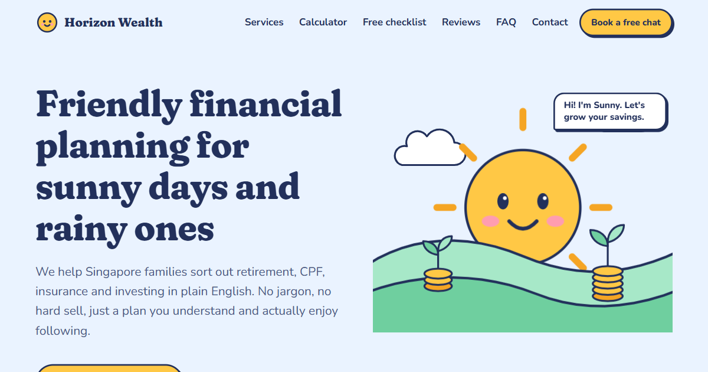
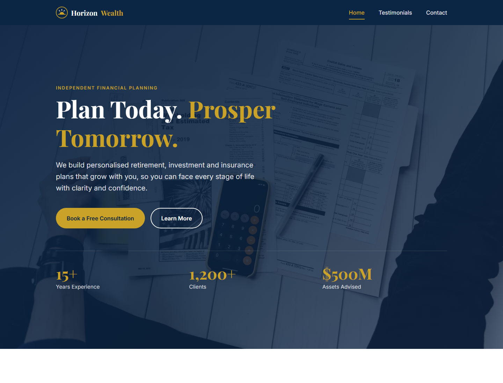

# Horizon Wealth Planning

A one-page marketing site for **Horizon Wealth Planning**, a fictional financial planning firm. It is one self-contained `index.html` with inline CSS and vanilla JavaScript. There are no frameworks and no build step.

**Live site (v2):** https://alfredang.github.io/finacial2/v2/
**Live site (v1):** https://alfredang.github.io/finacial2/



## Versions

The repo serves two independent versions from one GitHub Pages site. Each is a single self-contained HTML file.

| Version | File | URL | Style |
|---|---|---|---|
| v2 | [v2/index.html](v2/index.html) | `/finacial2/v2/` | Friendly and cute, built for SEO, lead capture and hardened security |
| v1 | [index.html](index.html) | `/finacial2/` | The original navy-and-gold design, left unchanged |

### What's new in v2

- **Look and feel:** a friendlier, cuter identity. Sunny, a smiling sun mascot, rises over coin-sprout hills in an inline SVG hero. Components use a sticker style (chunky ink outlines, offset shadows). Headings are set in Fraunces (soft, wonky axes) and body text in Nunito, on a sky / sun / mint / blush palette.
- **SEO:** keyword-focused title and meta description (Singapore, CPF, retirement), canonical URL, Open Graph and Twitter cards with a 1200×630 `og-image.png`, and JSON-LD (`FinancialService` with address and opening hours, `WebSite`, and a `FAQPage` that mirrors the visible FAQ). Also: one H1 with a logical heading hierarchy, a services section and FAQ written around local search terms, `lang="en-SG"`, and a [sitemap.xml](v2/sitemap.xml). The hero is inline SVG, so there is no large image to slow down LCP.
- **Lead magnets:**
  - an interactive retirement calculator whose "Ask a planner to check my numbers" button prefills the enquiry form with the results
  - a free Money Check-up Checklist that asks only for an email and then unlocks an interactive, printable checklist on the page
  - a polite slide-in offer that appears once per session and never covers the form
  - a shorter enquiry form, clear CTAs throughout, and a monthly email signup
- **Security hardening:**
  - a strict meta Content-Security-Policy with sha256 hashes for the inline script and style, so there's no `unsafe-inline`. It also sets `connect-src 'none'`, `object-src 'none'` and `base-uri 'none'`.
  - Referrer-Policy, frame-busting (meta CSP can't set `frame-ancestors`), and `maxlength` limits plus control-character stripping on every input
  - honeypot fields and time-to-submit checks against bots, plus per-form throttling
  - DOM writes use `textContent` only, and no PII is logged to the console
  - third-party requests reduced to Google Fonts only: v2 drops the pravatar avatars and the Unsplash hero

**After editing the inline CSS or JS in v2, regenerate the CSP hashes or the browser will block them:**

```bash
node tools/csp-hash.js
```

### v1



## Features

- Sticky header with a responsive hamburger nav
- Hero section with count-up statistics
- Testimonials carousel with autoplay, dots, keyboard support and pause-on-hover/focus. It shows 1 slide below 1024px and 3 at 1024px and up.
- Enquiry form with client-side validation and accessible error messages
- Newsletter signup, footer quick links and a back-to-top button
- Fade-in on scroll, with `prefers-reduced-motion` respected throughout

## Placeholder content

None of this is real. The firm, the hero statistics, the testimonials, the email (`hello@horizonwealth.example`), the phone number (`+65 6123 4567`) and the office address are all placeholders. Avatars come from [pravatar.cc](https://pravatar.cc) and the hero image from Unsplash.

**The forms do not send anywhere.** On a valid submit the v1 enquiry form logs its data to the browser console and shows a success message. v2 logs nothing: its forms validate, show success and (for the checklist) unlock content, but send no data. To collect real enquiries, wire the submit handler in the `<script>` (section 5, enquiry form) to a backend or form service.

## Run locally

No install is needed. Open the file directly:

```powershell
Start-Process index.html
```

Or serve it:

```bash
python -m http.server 8000   # then visit http://localhost:8000
```

## Testing

There is no test suite. To syntax-check the inline JavaScript (Git Bash):

```bash
sed -n '/<script>/,/<\/script>/p' index.html | sed '1d;$d' > "$TEMP/hw.js" && node --check "$TEMP/hw.js"
```

## Deployment

On every push to `main`, [.github/workflows/pages.yml](.github/workflows/pages.yml) publishes the repo root to GitHub Pages, so v1 is served at the site root and v2 from the `v2/` folder. It can also be triggered manually from the Actions tab.

In a fork or a new copy, turn Pages on once before the first deploy: go to Settings → Pages and set Source to **GitHub Actions**. The workflow's default token can't create the Pages site on its own.

## Contributing conventions

- **Single file only.** All CSS goes in the one `<style>` tag and all JS in the one `<script>` tag. Don't add frameworks, build tools or separate files.
- **Numbered sections.** CSS, HTML and JS are each split into numbered, commented sections. Put new code in the matching section.
- **Design tokens.** Use the `:root` custom properties (`--navy`, `--gold`, `--bg`, `--space-*` and so on) instead of hard-coded colours or spacing. Styles are mobile-first, and the 768px and 1024px media queries only add overrides.
- **Carousel slides.** Each slide is an `<article>` inside `#carousel-track`. When you add a slide, update `aria-label="n of N"` on every slide. Dots and stars are generated by the JS.
- **Form fields.** A new field needs:
  - a validator in the `validators` map, keyed by the field's `name`
  - a `<span id="{name}-error">` that the input references through `aria-describedby`
  - a `getTarget()` case if the red border belongs on a wrapper
  - an entry in the submitted `data` object
- **Accessibility.** Keep `aria-expanded`, `aria-current` and `aria-invalid` in sync whenever behaviour changes.

See [CLAUDE.md](CLAUDE.md) for more detail.
